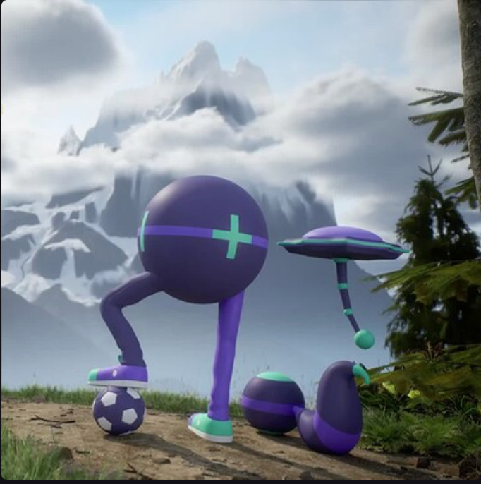
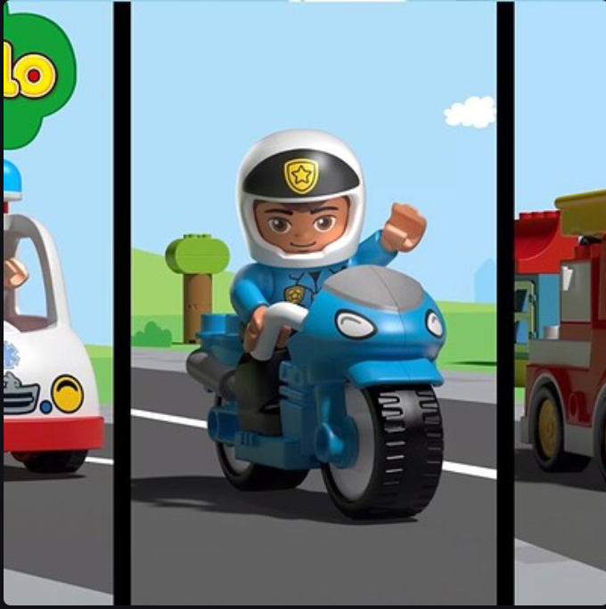
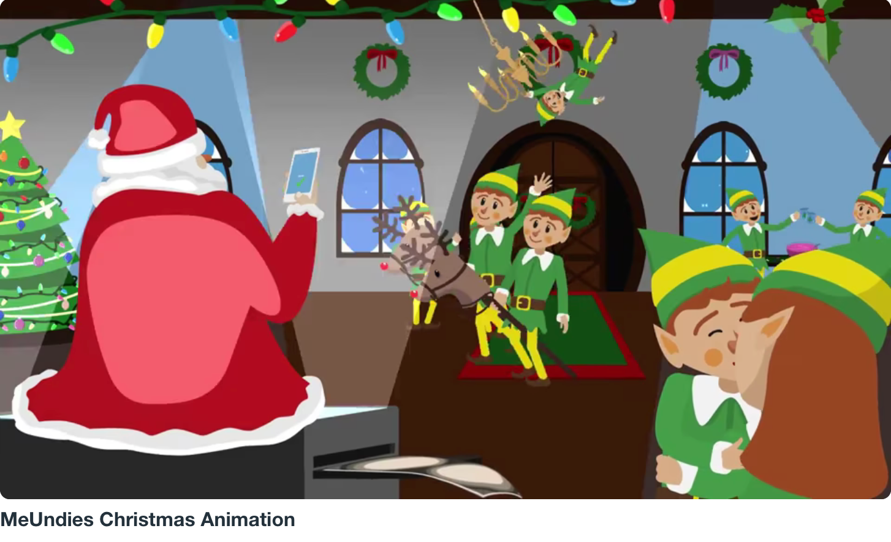
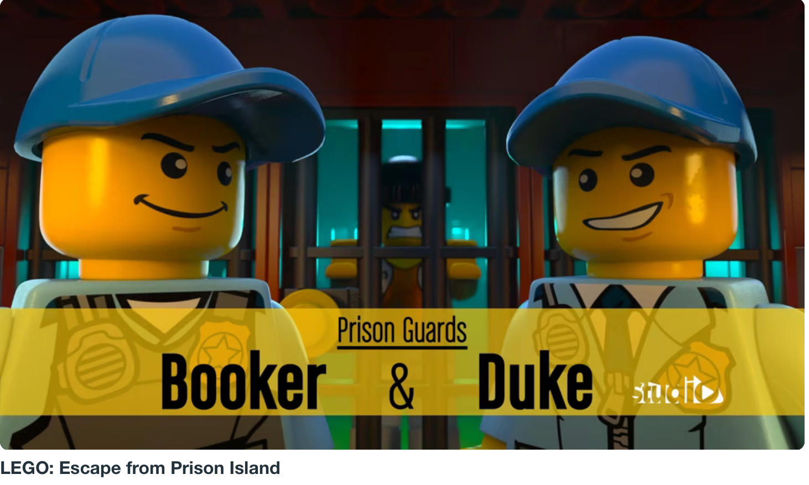
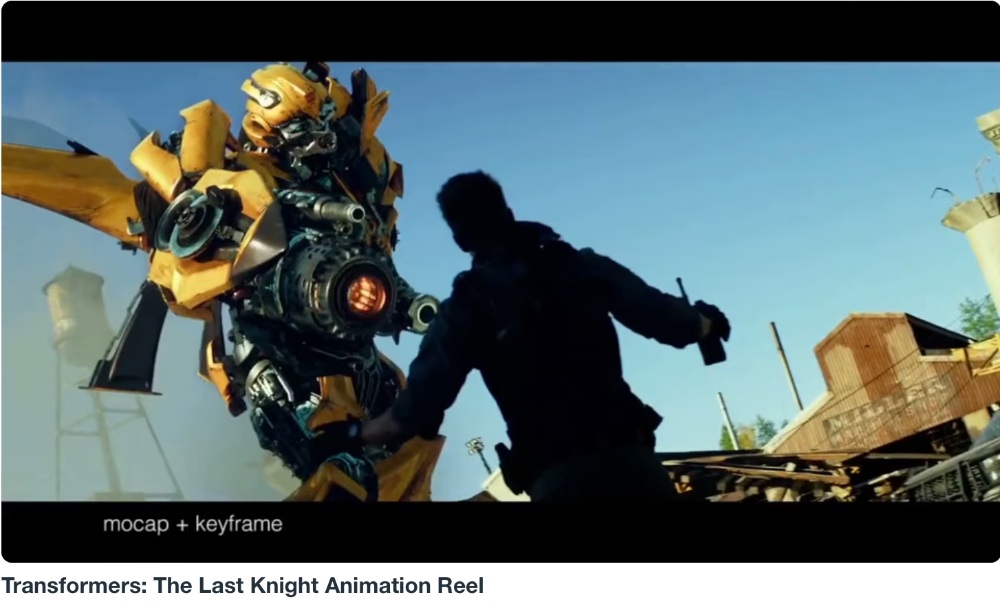
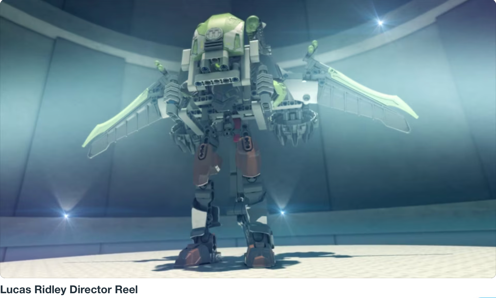
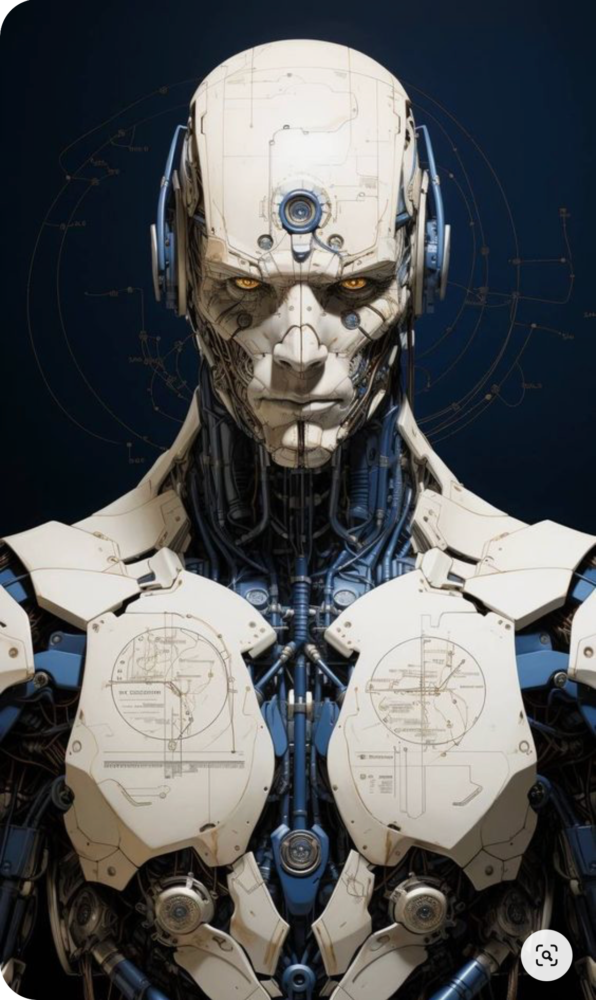
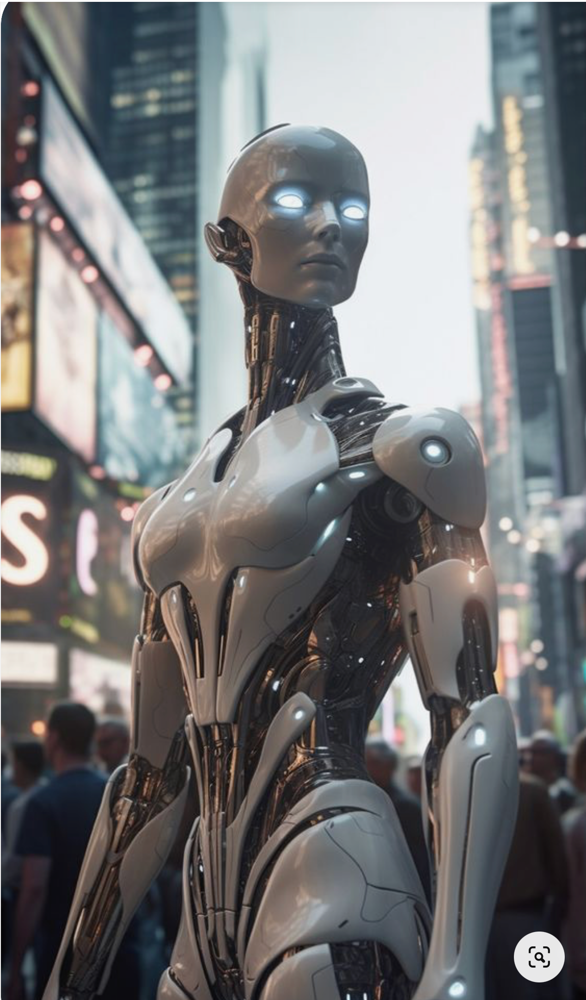

# Lucas Ridley

## Award-winning Animator

#### He has worked on a broad range of projects from VR, commercials, games, and film using both keyframe animation and mocap in a variety of styles. He has also led teams doing freelance work for companies like LEGO as well as mentor students in his animation courses. He enjoy a challenge, constantly learning, and being a part of a team.

    
    

    
    

    
    

    
    

#### His work has been featured in Annie-nominated, Emmy-winning, and Oscar short-listed short films. He's an animator and commercial director and he has created content for brands like LEGO, Braun, Nestle, and Anhueser-Busch. He recently worked at the birthplace of visual effects, Industrial Light & Magic where he worked on films by Michael Bay and Steven Spielberg and most recently on the record-breaking Avenger's: Infinity War as an animator

#### He's eager to share his professional knowledge that has allowed him to make a career out of creating content for big brands and big movies.
