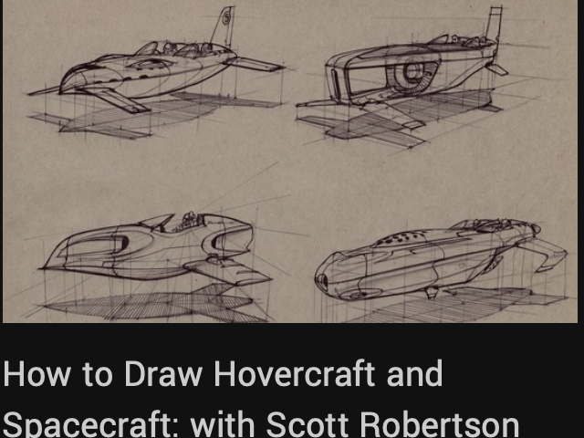
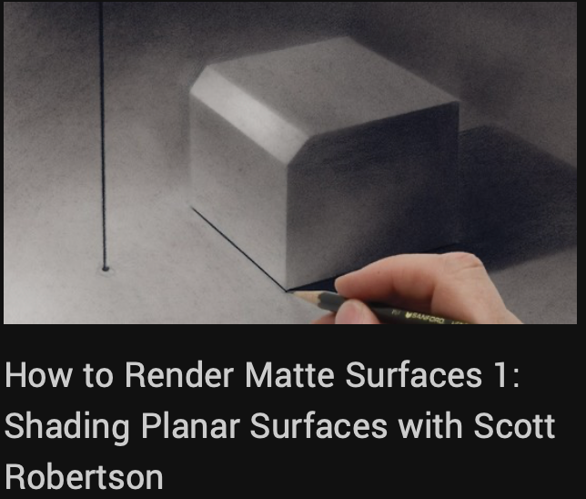
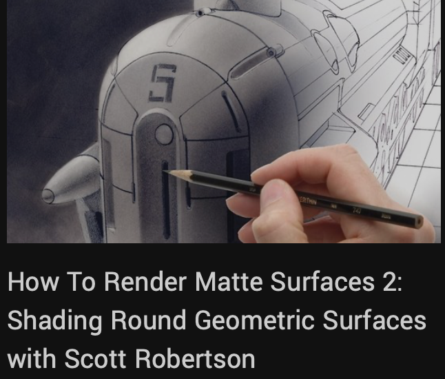
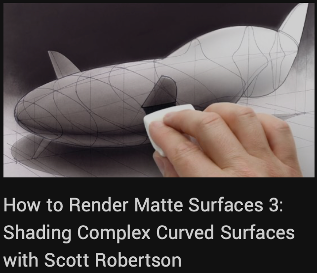

# SCOTT ROBERTSON

## Designer Founder, Design Studio Press

Scott attended Art Center College of Design where he graduated with honors with a B.S. degree in Transportation Design in April 1990. The day after graduation, Scott opened a product design consulting firm in San Francisco with friend Neville Page. While there clients included Kestrel, Giro Sport Design, Nissan, Volvo, and Yamaha. In 1995 Scott relocated to Vevey, Switzerland to teach drawing and industrial design at Art Center, Europe until the middle of 1996. Since returning from Europe, Scott's clients have included BMW subsidiary Design-works/USA, Raleigh Bicycles, Mattel Toys, Patagonia, Minority Report feature film, Nike, Rock Shox, Universal Studios, Angel Studios and Fiat, to name a few. Today he continues to teach drawing at Art Center College of Design. Recently, Scott launched Design Studio Press, a publishing company dedicated to inspiring and educational art books and DVDs.

    
    

    
    

    
    

