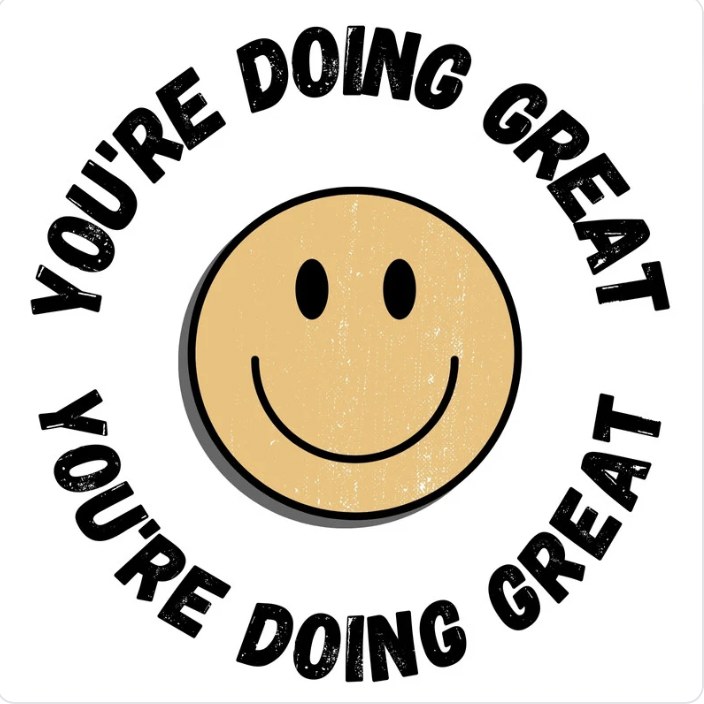
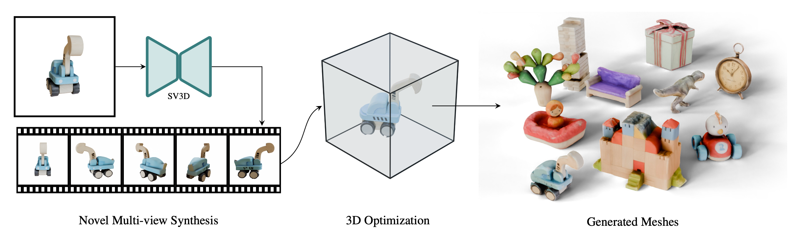

# AI-digital-art-works

## Project Overview
"AI-digital-art-works" is a project dedicated to showcasing and sharing digital art pieces that blend artificial intelligence technology with artistic creation. As a courageous digital artist, I strive to display my unique abilities and characteristics while pursuing my artistic dreams and goals. This project will feature a large collection of excellent digital artworks, highlighting the artistic possibilities made achievable through AI technology.

## Project Content
- **Artwork Showcase**: A curated collection of digital artworks covering various styles and themes.
- **Creation Process**: Detailed descriptions of the creation process and the AI technologies used for each piece.
- **Tutorials and Resources**: Providing tutorials and resources on how to use AI tools for digital art creation.
- **Community Interaction**: Welcoming other artists and enthusiasts to share their works and ideas, fostering collaboration and exchange.

## Goals
- **Inspire Creativity**: Inspire other artists by showcasing the fusion of AI and digital art.
- **Share Techniques**: Share experiences and techniques for using AI technology in art creation, promoting the development of digital art.
- **Exhibit Works**: Build a rich portfolio of digital artworks, demonstrating the diversity and potential of AI art creation.

 
We welcome everyone to follow and participate in the "AI-digital-art-works" project. Let's explore and create more wonderful digital artworks together!
&nbsp;&nbsp;

https://www.youtube.com/watch?v=JucIXdRAFHw