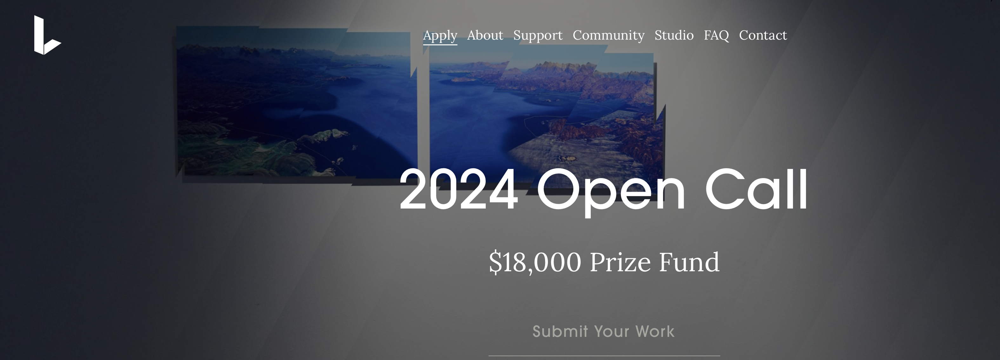

# CG-Artist-Works

## Project Overview

"CG-Artist-Works" is a project dedicated to showcasing and sharing CG art pieces that blend artificial intelligence
technology with artistic creation. As a courageous CG artist, I strive to display my unique abilities and
characteristics while pursuing my artistic dreams and goals. This project will feature a large collection of excellent
CG artworks, highlighting the artistic possibilities made achievable through AI technology.

## Project Content

- **Artwork Showcase**: A curated collection of CG artworks covering various styles and themes.
- **Creation Process**: Detailed descriptions of the creation process and the AI technologies used for each piece.
- **Tutorials and Resources**: Providing tutorials and resources on how to use AI tools for CG art creation.
- **Community Interaction**: Welcoming other artists and enthusiasts to share their works and ideas, fostering
  collaboration and exchange.

## Goals

- **Inspire Creativity**: Inspire other artists by showcasing the fusion of AI and CG art.
- **Share Techniques**: Share experiences and techniques for using AI technology in art creation, promoting the
  development of CG art.
- **Exhibit Works**: Build a rich portfolio of CG artworks, demonstrating the diversity and potential of AI art
  creation.

 
We welcome everyone to follow and participate in the "CG-Artist-Works" project. Let's explore and create more wonderful CG artworks together!
&nbsp;&nbsp;

